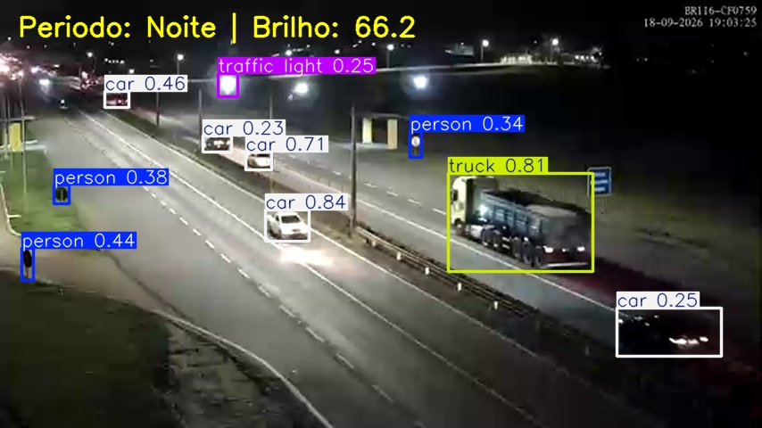
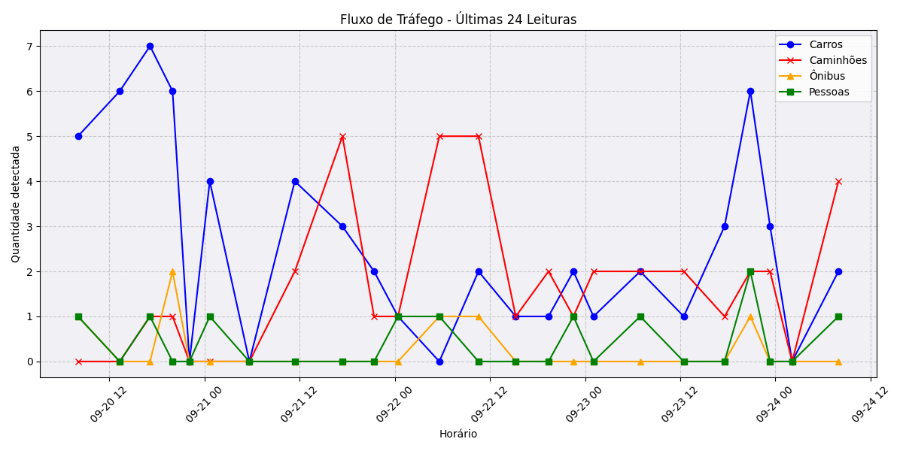

# 🚦 Monitoramento Automático de Tráfego

Este repositório atua como um pipeline de dados automatizado. A cada 1 hora, o GitHub Actions captura uma imagem de trânsito ao vivo, executa inferência via YOLOv8 para contar veículos e salva os dados históricos em um arquivo CSV.

### 📸 Última Detecção Ao Vivo
*(Atualizado de hora em hora)*



### 📊 Tendência das Últimas 24 Horas



## 🗺️ Visão Geral da Ideia

```mermaid
flowchart TD
    %% Estilos visuais
    classDef idea fill:#f9f,stroke:#333,stroke-width:2px;
    classDef process fill:#bbf,stroke:#333,stroke-width:2px;
    classDef storage fill:#bfb,stroke:#333,stroke-width:2px;
    classDef output fill:#ff9,stroke:#333,stroke-width:2px;

    %% Nós do Fluxograma
    A[Ter a Ideia: Monitorar Trânsito Automaticamente]:::idea --> B[Escolher uma Câmera Pública ao Vivo]:::process
    B --> C[Definir a Frequência de Coleta: Ex. De hora em hora]:::process
    
    C --> D[Automação em Segundo Plano]:::process
    
    subgraph O que o Robô Faz [Ciclo Automático]
        D --> E[Capturar o momento exato da imagem]:::process
        E --> F[Processar a imagem para identificar e contar veículos]:::process
        F --> G[Analisar se é dia ou noite]:::process
    end

    G --> H[(Guardar o histórico dos números)]:::storage
    G --> I[(Guardar a foto mais recente)]:::storage

    H --> J[Criar uma Tela Visual / Dashboard]:::output
    I --> J

    J --> K[Acompanhar os dados e gráficos de qualquer lugar]:::output

    %% Transição cíclica
    D -.->|Repete sozinho| E