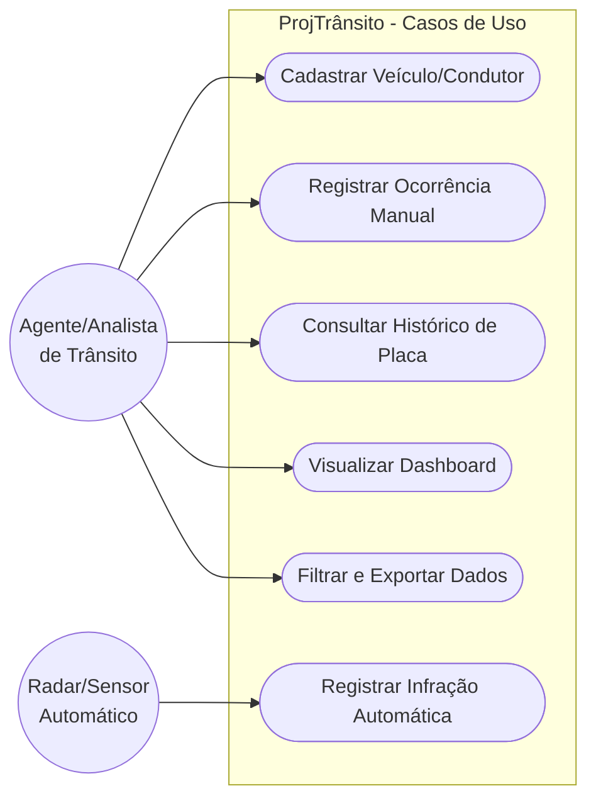
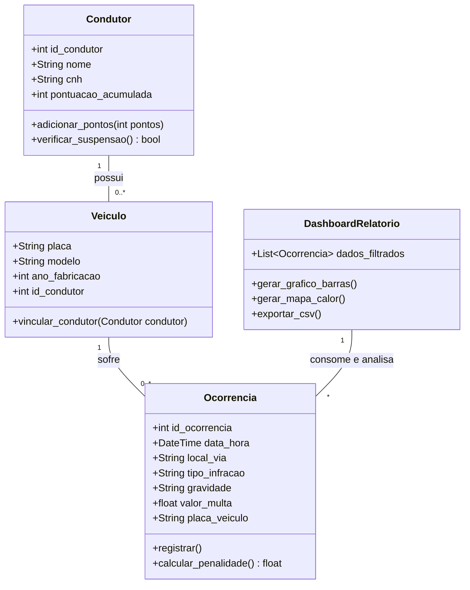
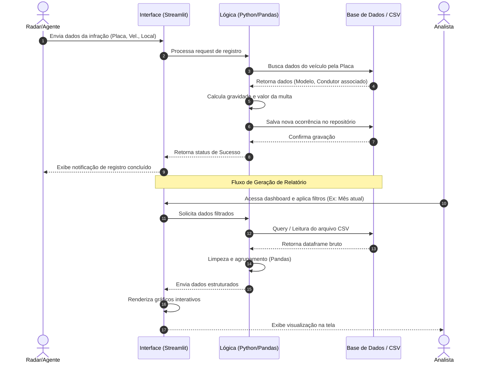
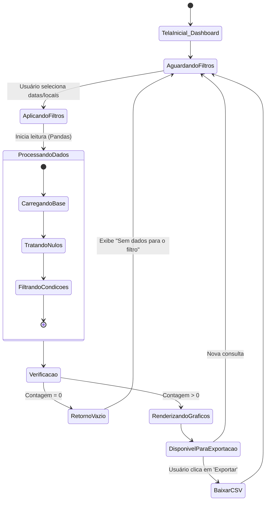

# Documentação de Engenharia de Software - ProjTrânsito

Esta documentação fornece uma visão arquitetural e estrutural completa do projeto **ProjTrânsito**, englobando desde a sua concepção e requisitos até a modelagem visual do sistema.

---

## 1. Formalização e Documentação do Projeto

### 1.1 Visão Geral
O **ProjTrânsito** é um sistema computacional focado no registro, processamento, análise e monitoramento de dados referentes ao tráfego urbano, veículos, condutores e infrações. O sistema atua como uma plataforma centralizadora para órgãos de controle ou equipes de análise de dados, permitindo transformar dados brutos de ocorrências de trânsito em insights analíticos estruturados.

### 1.2 Justificativa
A gestão do trânsito urbano gera um volume massivo de dados diariamente. A ausência de uma ferramenta integrada para análise desses dados dificulta a tomada de decisões, como a identificação de vias perigosas, horários de pico de acidentes ou o perfil de condutores infratores. O ProjTrânsito surge para automatizar o processamento dessas informações e fornecer painéis interativos de fácil visualização.

### 1.3 Stack Tecnológica e Arquitetural (Proposta)
A infraestrutura do projeto se baseia em ferramentas modernas de engenharia de dados e desenvolvimento de software:
* **Linguagem Principal:** Python (para automação, processamento e backend).
* **Manipulação de Dados:** Biblioteca Pandas para tratamento, limpeza e cálculos estatísticos.
* **Interface e Dashboard:** Streamlit para a criação rápida de aplicações de dados interativas.
* **Versionamento e CI/CD:** GitHub para repositório e GitHub Actions para pipelines de integração e deploy contínuo.
* **Infraestrutura:** Docker para conteinerização da aplicação, garantindo portabilidade entre ambientes.

---

## 2. Engenharia Reversa

Com base na estrutura de sistemas de processamento e exibição de dados de trânsito (e nos padrões de dashboards em Streamlit/Python), o fluxo arquitetural deduzido do sistema funciona da seguinte maneira:

### 2.1 Fluxo de Ingestão e Processamento (Pipeline)
1. **Coleta de Dados:** O sistema consome bases de dados brutas (arquivos CSV, integração com bancos de dados relacionais ou APIs externas) contendo informações de radares, viaturas e registros manuais.
2. **Processamento (ETL):** Módulos em Python utilizam Pandas para realizar a limpeza (tratamento de valores nulos, conversão de datas e horários) e a transformação dos dados (cálculo de frequências de infrações, soma de multas).
3. **Persistência:** Os dados tratados são cacheados na memória ou salvos em uma camada de banco de dados estruturada para consulta otimizada.
4. **Camada de Apresentação:** O frontend renderiza gráficos (barras, dispersão, mapas de calor geográficos) e tabelas dinâmicas, permitindo que o usuário interaja por meio de filtros.

---

## 3. Levantamento de Requisitos

Os requisitos definem o escopo do projeto, dividindo-se entre o que o sistema deve fazer (Funcionais) e como deve se comportar (Não Funcionais).

### 3.1 Requisitos Funcionais (RF)
| ID | Descrição | Prioridade |
|---|---|---|
| **RF01** | O sistema deve permitir o cadastro, leitura, atualização e exclusão (CRUD) de veículos. | Alta |
| **RF02** | O sistema deve permitir o gerenciamento de informações dos condutores (CNH, nome, pontuação). | Alta |
| **RF03** | O sistema deve registrar novas ocorrências de trânsito associando-as a uma placa de veículo, data, hora, local e tipo de infração. | Alta |
| **RF04** | O sistema deve possuir um dashboard interativo para visualização de métricas e gráficos. | Alta |
| **RF05** | O dashboard deve permitir a aplicação de filtros dinâmicos (por período, gravidade da infração, região). | Média |
| **RF06** | O sistema deve calcular automaticamente a penalidade (pontos na CNH e valor monetário) com base na gravidade da infração. | Alta |
| **RF07** | O sistema deve permitir a exportação dos relatórios processados em formatos consolidados (como CSV ou PDF). | Baixa |

### 3.2 Requisitos Não Funcionais (RNF)
| ID | Descrição | Critério de Aceitação |
|---|---|---|
| **RNF01** | **Desempenho:** O processamento das bases de dados deve ser rápido. | Filtros no dashboard devem refletir nos gráficos em menos de 2 segundos utilizando Pandas. |
| **RNF02** | **Portabilidade:** A aplicação deve ser executável em qualquer ambiente sem necessidade de instalar dependências complexas no host. | O sistema deve ser empacotado e executado perfeitamente via imagem Docker (`Dockerfile`). |
| **RNF03** | **Usabilidade:** A interface deve ser responsiva e clara. | Utilização de componentes visuais do Streamlit adaptáveis a diferentes tamanhos de tela. |
| **RNF04** | **Confiabilidade:** O código-fonte deve ser testado antes da integração no branch principal. | Fluxos de CI/CD via GitHub Actions devem aprovar as validações a cada *push* ou *pull request*. |

---

## 4. Diagramas UML

Os diagramas abaixo foram escritos em linguagem **Mermaid**. Eles podem ser visualizados diretamente nativamente no GitHub (ao dar *commit* deste arquivo no seu repositório), ou copiando e colando o código em ferramentas como o [Mermaid Live Editor](https://mermaid.live) ou plugins do Lucidchart/Draw.io.

### 4.1 Diagrama de Casos de Uso
Ilustra as interações entre os atores (usuários/sistemas externos) e as funcionalidades do sistema.

### 4.2 Diagrama de Classes
Mapeia a estrutura de dados, entidades fundamentais e as relações entre elas no domínio do problema.

### 4.3 Diagrama de Sequência (Registro de Infração e Análise)
Descreve o fluxo passo-a-passo e a troca de mensagens desde o registro de uma infração até a visualização no sistema.

### 4.4 Diagrama de Atividades (Filtragem e Visualização)
Mostra o fluxo lógico de decisão e processamento ao interagir com o painel de análise.

